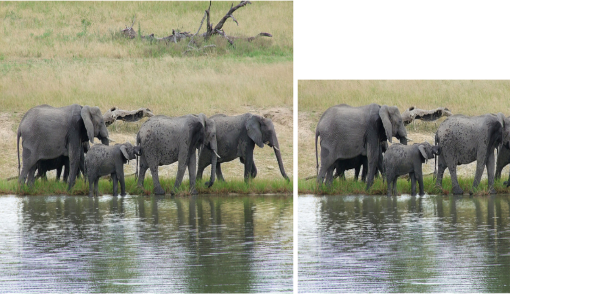
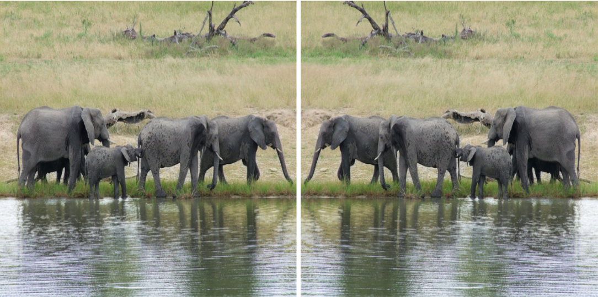
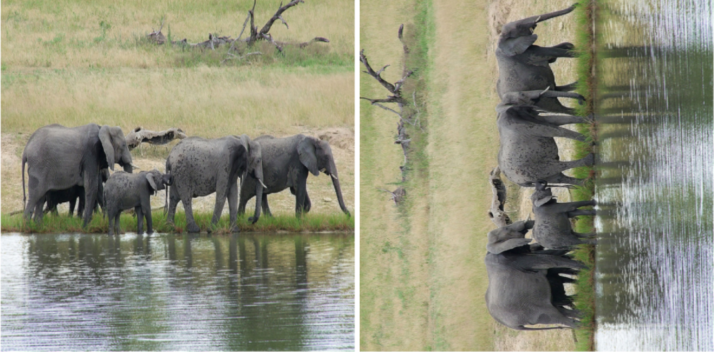
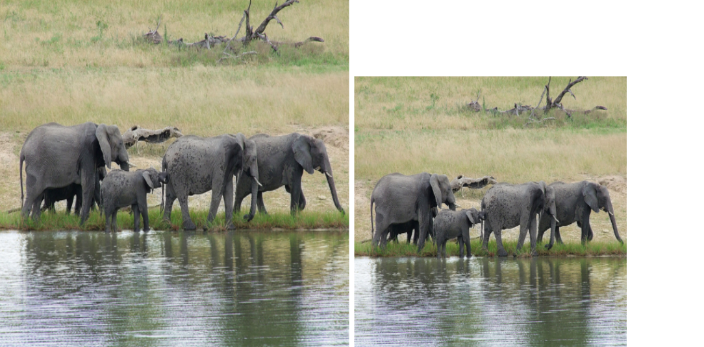
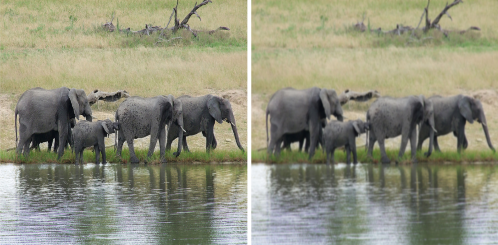

# Software Lab 

## Python Datascience Assignment

In this assignment we will deal with **Image Captioning**. Image Captioning is the process of generating textual description of an image. You have to create a python package for transforming images and analysing their effect on the captions of an image captioning model. We are providing you with a pretrained captioning model, all you need to do is to call the model on the image and get the outputs.

A python package means that one can install the package in the python environment and can import the modules in any python script, irrespective of the location of the script. Creating a python package is fairly easy, just follow the steps [here](https://packaging.python.org/tutorials/packaging-projects/).

## Installation instructions

Note: To install the dependencies you need to run the following commands:
 - `pip install -r requirements.txt`
 - `python3 -m spacy download en_core_web_sm`
 - Download LAVIS zip into the project directory from https://github.com/salesforce/LAVIS, Unzip LAVIS-main.zip and install lavis using the following commands 
    * `cd LAVIS-main/`
    * `pip install .`

## File descriptions

1. `main.py`: This is the main file which is to be called to execute the program. The main file calls the corresponding functions as needed while execution. The main file should call the appropriate function to prepare the dataset, then transform the images read, obtain the captions in the image by calling the captioner model, and then plot the obtained images by calling the appropriate functions from the package described below.

2. `./my_package/model.py`: This file contains the image captioning model definition. Consider it as a black-box model which takes an image and number of captions to be generated as input and provides the captions as output.

&nbsp;
<p align="center">

</p>
<p align="center">
<b>Fig. 1</b>. Sample Output of the Captioner. </p>
&nbsp;


3. `./my_package/data/dataset.py`: This file contains the class ```Dataset``` that reads the provided dataset from the annotation file and provides the  transformed image object. The annotation format is provided in `data/README.md`

4. `./my_package/data/transforms`: This folder contains 5 files. Each of these files is responsible for performing the corresponding transformation, as follows:
	
a) `crop.py`: This file takes an image as input and crops it based on the provided arguments. Declare a class `CropImage()` for performing the operation. 

&nbsp;
<p align="center">

</p>
<p align="center">
<b>Fig. (a)</b>. Crop Operation. </p>
&nbsp;
	
b) `flip.py`: This file takes an image as input and flips it based on the provided arguments. Declare a class `FlipImage()` for performing the operation. 

&nbsp;
<p align="center">

</p>
<p align="center">
<b>Fig. (b)</b>. Flip Operation. </p>
&nbsp;
	
c) `rotate.py`: This file takes an image as input and rotates it based on the provided arguments. Declare a class `RotateImage()` for performing the operation. 

&nbsp;
<p align="center">

</p>
<p align="center">
<b>Fig. (c)</b>. Rotate Operation. </p>
&nbsp;

d) `rescale.py`: This file takes an image as input and rescales it based on the provided arguments. Declare a class `RescaleImage()` for performing the operation. 

&nbsp;
<p align="center">

</p>
<p align="center">
<b>Fig. (d)</b>. Rescale Operation. </p>
&nbsp;

e) `blur.py`: This file takes an image as input and applies a gaussian blur to it based on the provided arguments. Declare a class `GaussBlurImage()` for performing the operation. 

&nbsp;
<p align="center">

</p>
<p align="center">
<b>Fig. (e)</b>. Blur Operation. </p>
&nbsp;

5. `./my_package/data/download.py` : This file takes in url (to download the image) and path (to store the downloaded image).

6. `setup.py`: Use this file for constructing the package `my_package`.

## Coding Task [30 marks]

Note: For handling images, e.g. reading images, etc. we would recommend using PIL instead of OpenCV as OpenCV uses `BGR` format instead of `RGB`.

1. Write the various transformations in `./my_package/data/transforms`. There are five files, as already mentioned. Although these functions are easily implementable using any image processing libraries like PIL, skimage or opencv. [2x5=10 marks]

2. Complete the `Dataset` class in `./my_package/data/dataset.py`. This class will accept the path to the annotation file and the list of transformation classes. Ideally you should be directly using transformation classes but you may also use strings to identify the transformations. [5 marks]

3. Complete the `Download` class in `./my_package/data/download.py` that will download the image from the url supplied and consequently store the image  at the correct path and filename should be same as in the annotaion file (`./data/annotations.jsonl`).[5 marks]

4. Create a python package ``` my_package```. For this you need to write ``` setup.py```. It must be noted that files called ```___init__.py``` need to be added in the hierarchy. We leave it to you to search where they should be added. Note that the user will generally not know the exact files where the classes are written. That means, he/she does not know that their exist a file ```crop.py``` where the class ```CropImage()``` is defined. Rather he/she simply knows that this class is defined in ```transforms```. So, a good coding practice is to allow an import statement ```from my_package.data.transforms import CropImage```. [5 marks]

5. Write ```main.py``` where you will test the different transformations you have written on the instance segmentor. The outputs for each of the experiments should be organized properly in the outputs folder. [5 marks]

## Analysis Task [10 marks]

1. Obtain and display the captions for all the images (which you dowmload) in the `data/imgs` folder. [3 marks]

2. Consider the image with name same as the last digit of your roll number, i.e. if your roll number is 20CS####7 then consider the image `7.jpg` then save the transformed images while printing the captions in console: [1x7=7 marks]

	a) The original image along with the 3 generated captions.

	b) Horizontally flipped original image along with the 3 generated captions.

	c) Blurred image (with some degree of blurring) along with the 3 generated captions.

	d) Twice Rescaled image (2X scaled) along with the 3 generated captions.

	e) Half Rescaled image (0.5X scaled) along with the 3 generated captions.

	f) 90 degree right rotated image along with the 3 generated captions.

	g) 45 degree left rotated image along with the 3 generated captions.

**Please read the class definitions very carefully. In this assignment you do not need to code a lot, but you need to understand how to integrate several custom modules together in a clean way. More details on the arguments and the return types are provided in the corresponding files.**
